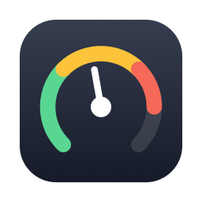
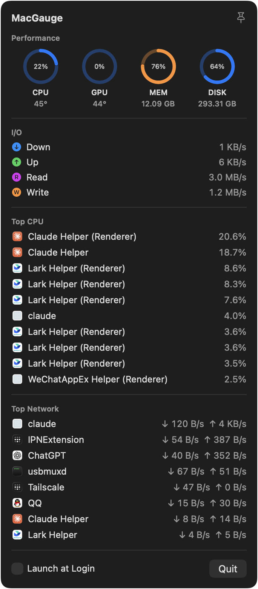
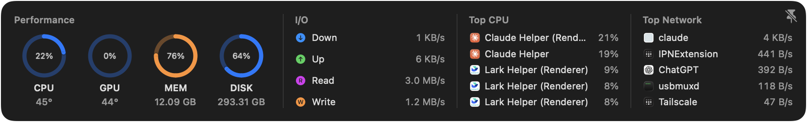

<p align="center">
  
</p>

<h1 align="center">MacGauge</h1>

<p align="center">A lightweight macOS menu-bar system monitor for Apple Silicon Macs.</p>

MacGauge lives in your menu bar showing live CPU usage, and expands into a
stats panel that can be pinned to the corner of your screen as a compact,
always-on-top strip — a "live widget" that updates every 2 seconds, faster
than macOS widgets ever could.

## Screenshots

**Menu bar panel** — click the gauge icon in the menu bar:



**Pinned panel** — click the pin to keep a compact strip floating at the
top-right corner of your screen:



## Features

- **Performance gauges** — CPU, GPU, memory, and disk usage, with CPU/GPU die
  temperatures
- **I/O speeds** — network down/up and disk read/write throughput
- **Top CPU processes** — with app icons, Activity Monitor style
- **Top disk R/W processes** — per-process disk read/write throughput
- **Top network processes** — per-process down/up traffic
- **Pinned panel** — one click pins a horizontal compact panel to the
  top-right corner, floating above all windows on every Space; drag it
  anywhere
- **Launch at login** toggle, everything updates every 2 s

## Install

### Homebrew

```sh
brew tap sky31even/tap
brew install --cask macgauge
```

The app is signed but not notarized. If macOS blocks the first launch,
right-click **MacGauge.app** in /Applications and choose **Open** (needed only
once), or:

```sh
xattr -d com.apple.quarantine /Applications/MacGauge.app
```

### Build from source

Requires Xcode and [XcodeGen](https://github.com/yonaskolb/XcodeGen):

```sh
git clone https://github.com/sky31even/MacGauge.git
cd MacGauge
xcodegen generate
./install.sh   # builds Release and installs to /Applications
```

Adjust `DEVELOPMENT_TEAM` / `CODE_SIGN_IDENTITY` in `project.yml` to match
your own certificate (any Apple Development certificate works for local use).

## How it reads the numbers

| Metric | Source |
|---|---|
| CPU load | `host_processor_info` tick deltas |
| GPU load | IORegistry `IOAccelerator` → `PerformanceStatistics` |
| Memory | `host_statistics64` (app + wired + compressed, Activity Monitor style) |
| Disk space | `URL.resourceValues` on `/` |
| Disk I/O | IORegistry `IOBlockStorageDriver` byte counters |
| Network total | `getifaddrs` interface byte counters |
| Network per process | `/usr/bin/nettop` counter deltas |
| Temperatures | Private `IOHIDEventSystemClient` sensors + AppleSMC key enumeration |
| Top CPU processes | `proc_listallpids` + `proc_pid_rusage` CPU-time deltas |
| Top disk R/W processes | `proc_pid_rusage` disk I/O byte deltas |

## Limitations

- Temperature reading uses private APIs (the same approach as Stats, iStat
  Menus, and asitop), so MacGauge is not App Store distributable.
- Per-process **GPU** usage would require root (`powermetrics`); process
  rankings cover CPU, disk, and network only.
- Intel Macs are untested (temperatures fall back to SMC `sp78` keys).

## License

MIT
